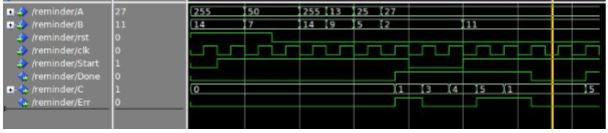

# Remainder Calculator

## Question 
Design a​ 5-stage PipeLined​ digital system that will compute the remainder  
<div align="center"> C = A mod B </div>

 * the number A in the range from 0 to 255 (i.e., an 8-bit ​unsigned​ number)
 * the number B in the range from ​8 to 15 ​(i.e., a 4-bit ​unsigned ​number with the most significant bit set to 1).  
 * <strong>You are​ not allowed​ to use the following operators ( mod,/,*) 

### Inputs
1. Clock 
2. Reset (1 → asynchronous and set all registers to value of  0)
3. A : 8-bits input read at each rising edge of the clock
4. B : 4-bits input read at each rising edge of the clock
5. Start :  1 → the system will start computation. </br>
            0 → the system will stop receiving inputs (the operations in the pipe will continue till they finish)

### Outputs
1. C : 4-bits output represents the reminder
      * The First remainder value is generated after 4 clock cycles (at the 5th rising edge).
      *  The rest of the results should be generated at the 6,7,8,9, ….etc. (like any normal pipeline). 
2. Done:  is raised to One when a valid output is generated, else 0. 
3. Err : is raised to One if B value is smaller than 8 else 0 


### Pseudocode:

```cs
A_reg = A
B_reg = B*2^24

for i = 0 to 5
{
    if(A_reg > B_reg)
    {
        A_reg = A_reg - B_reg
    }
    B_reg = B_reg >> 1
}
C = A_reg[3 downto 0]
```

### Simulation
<div align="center"> </div>